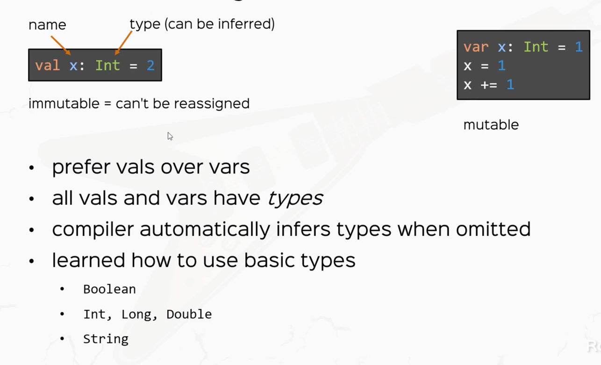

# Scala and Functional Programming | Rock the JVM

A step-by-step guide of the Scala and Functional Programming course (Rock the JVM).

## 1. Getting Started!

- To create a new Scala project, use the IDEA - based Scala project:

  
  

- To add the Scala plugin, use the Marketplace tab to browse and install it.

  

- To add the Scala library to an existing project, add it in the Project Structure:

  

## 2. The Absolute Scala Basics

### 2.1. Values, Variables and Types
  

### 2.2. Expressions
- Everything in Scala is an expression: operators, ifs, code blocks,...
- The value of the code block is the value of its last expression.
- Instructions are executed (like in Java), expressions are evaluated (Scala).

