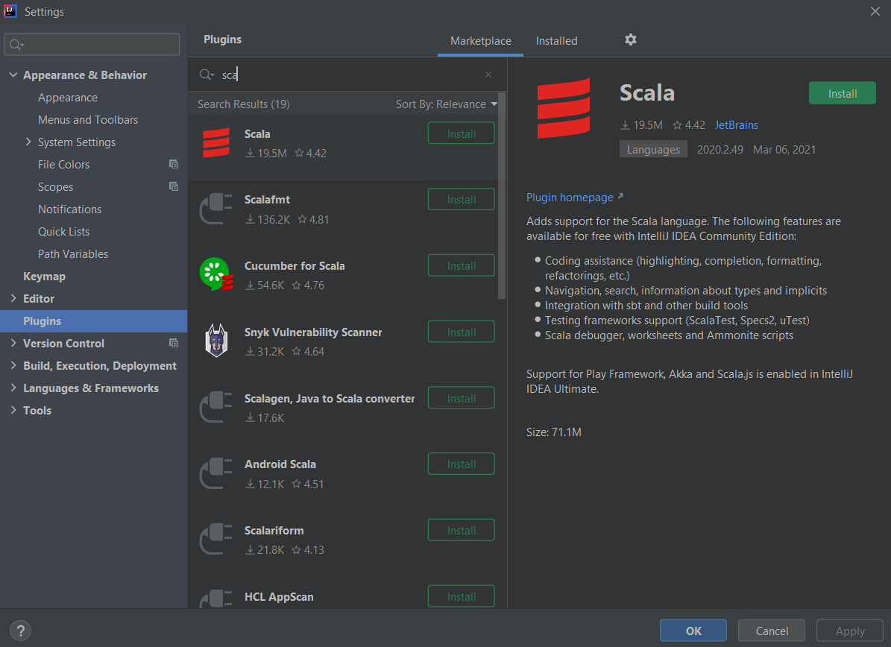

# Scala and Functional Programming | Rock the JVM

A step-by-step guide of the Scala and Functional Programming course (Rock the JVM).

## 1. Getting Started!

- To create a new Scala project, use the IDEA - based Scala project:

  
  

- To add the Scala plugin, use the Marketplace tab to browse and install it.

  

- To add the Scala library to an existing project, add it in the Project Structure:

  

## 2. The Absolute Scala Basics

### 2.1. Values, Variables and Types
- Values: Immutable with a name and type (can be inferred).
- Variables: Mutable.
- Prefer als over vars.
- All vals and vars have types.
- Compiler automatically infers types when omitted.
- Basic types: Boolean, Int, Long, Double, String.

### 2.2. Expressions
- Everything in Scala is an expression: operators, ifs, code blocks,...
- The value of the code block is the value of its last expression.
- Instructions are executed (like in Java), expressions are evaluated (Scala).

### 2.3. Functions
- When you need loops, use recursion (No imperative code!).

### 2.4. Recursion
- When you need loops, use tail recursion.
- You need as many accumulators as recursive calls you have in a tail recursive function.

### 2.5. Call by Value Vs Call by Name
- Call by value:
  - Value is computed before the call;
  - Same value used everywhere.
- Call by name:
  - Expression is passed literally;
  - Expression is evaluated every time/use.

### 2.6. Default and Named Arguments
- You can set default values, and omitted them when the function is called.
- You cannot omit leading default values, unless you name them (even in a different order).  

